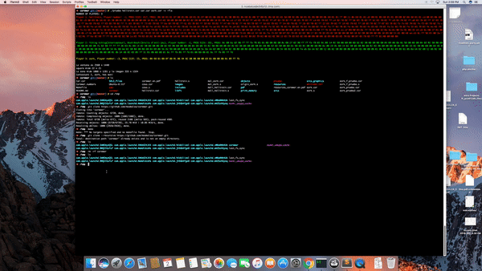

Corewar
=====
## 1 What is Corewar?

>Corewar is a very peculiar game. It’s about bringing “players” together around a “VIRTUAL MACHINE”, which will load some >“champions” who will fight against one an- other with the support of “processes”, with the objective being for these >champions to stay “alive”.
>The processes are executed sequentially within the same virtual machine and mem- ory space. They can therefore, among other >things, write and rewrite on top of each others so to corrupt one another, force the others to execute instructions that can >damage them.
>The game ends when all the processes are dead. The winner is the last player reported to be “alive”.


This project can be divided into three distinctive parts:

### 1. 1 The assembler:
This is the program that will compile your champions and trans- late them from assembly language into “Byte- code”, a machine code, which will be directly interpreted by the virtual machine.
### 1. 2 The virtual machine:
It’s the “arena” in which the champions will be executed. It offers various functions, all of which will be useful for the battle of the champions. It allows to execute numerous simultaneous processes.
### 1. 3 The champion:
For now, only needs to prove that writing some bits and pieces of assembly language.

## Allowed functions
Within the project, it is allowed to use only the following libc functions:open, read, lseek, write, close, malloc, realloc, free, perror, strerror, exit.

## 2. VIRTUAL MACHINE


## 3. PROJECT USAGE
### 3.1 Clone and Compile
```
brew install sdl2_image
```
```
git clone --recursive https://github.com/mzabalza/corewar.git; make
```


### 3.2 Execute binary


